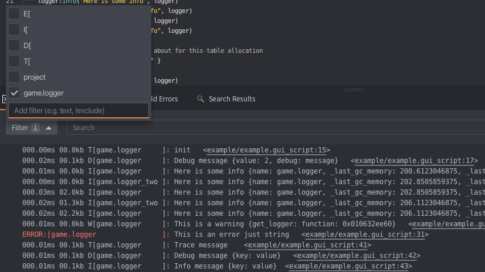

# Use Cases for the Log Module in Defold

This document provides practical examples of how to utilize the Log module in various scenarios to enhance your development workflow in Defold.

## 1. Memory and Time Profiling for Functions

Memory and time profiling are essential for optimizing the performance of your game. The Log module allows you to easily track how much memory and time your functions are using.

```lua
local log = require("log.log")
local logger = log.get_logger("game")

function init(self)
    logger:trace("Before expensive operation")

    expensive_operation()
    logger:trace("After expensive operation")
end
```

Output

```lua
000.01ms 00.0kb T[game      ]: Before expensive operation  	<example/example.gui_script:48>
553.63ms 49.7kb T[game      ]: After expensive operation  	<example/example.gui_script:50>
```

In this example, the `expensive_operation` function is profiled to measure the time and memory usage. This information can help you identify bottlenecks and optimize your game's performance.


## 2. Profile Module with Force Debug Level

Forcing a trace/debug level can be useful for detailed debugging of specific modules without changing the global log level. This approach helps in focusing on the relevant log messages during development.

```lua
local log = require("log.log")
local logger = log.get_logger("module.awesome", "TRACE")

function awesome_function()
    logger:trace("awesome_function")
    ...
    logger:debug("Some debug information", { data = data })
end

function init(self)
    awesome_function()
end
```

Here, the logger is forced to log at the trace level, while the rest of the application continues to log at the default level. This allows you to focus on the specific module's log messages without affecting the global log level.


## 3. Filter Logs in Defold Console

Defold's console allows filtering logs by level or logger name, enabling you to focus on the most relevant information. You can use the Log module's structured logging format to simplify this process.

For example, your can set up filters with "T[" to show only trace logs, "D[" to show only debug logs, and so on. or "[game" to show only logs from the "game" logger.




## 4. Example of using Log

Example of my output:
```lua
000.00ms 00.0kb D[nakama                ]: Session token is valid  	<core/system/nakama/nakama_core.lua:201>
049.94ms 19.8kb I[nakama                ]: Socket connected  	<core/system/nakama/nakama_core.lua:216>
000.00ms 00.0kb I[system.network_world  ]: Match created {self: {session_id: 8191398c-ce94-11ee-848c-3ec1ae061c27, user_id: 2248dc6f-1b74-4e1c-9a6e-666884544442, username: 3a882750-5b61-439c-c392-ca665dd6803d}, size: 1, match_id: 87bc296a-7477-5754-8a0a-40418ac58da3.} 	<core/system/network_world.lua:138>
000.13ms 01.8kb D[system.network_world  ]: Sending match data {presences: {1: {... #0}}, op_code: 2, data: {"world_id":"level1"}} 	<core/system/network_world.lua:100>
000.00ms 00.0kb D[system.field          ]: Turn results {1: {entity_id: player, data: {... #0}, action: movement}} 	<core/system/field.lua:109>
401.27ms 158.3kb D[system.network_world ]: Sending match data {op_code: 3, data: [{"entity_id":"player","data":{"distance":1,"side":"left"},"action":"movement"}]} 	<core/system/network_world.lua:100>
633.81ms 246.6kb D[system.field         ]: Turn results {1: {entity_id: player, data: {... #0}, action: movement}} 	<core/system/field.lua:109>
```


## 5. Integrating the Log Module into Your Library

To set ability to use custom logger in your library, you can use the following approach:

```lua
-- The trick with empty function saves a bit of memory
local EMPTY_FUNCTION = function() end

-- Create a logger object with functions for each log level
local logger = {
    trace = EMPTY_FUNCTION,
    debug = EMPTY_FUNCTION,
    info = EMPTY_FUNCTION,
    warn = EMPTY_FUNCTION,
    error = EMPTY_FUNCTION,
}

-- Add function to set the logger instance
function M.set_logger(logger_instance)
    M.logger = logger_instance
end
```

### Usage:

After setting an stub logger, you can use it in your library:

```lua
logger:warn("Something happened here:", {
    animation_path = animation_path,
    node_id = node_id
})
```

This allow to users of your library to set their logger instance and catch logs from your library.
